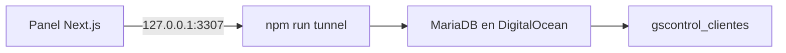
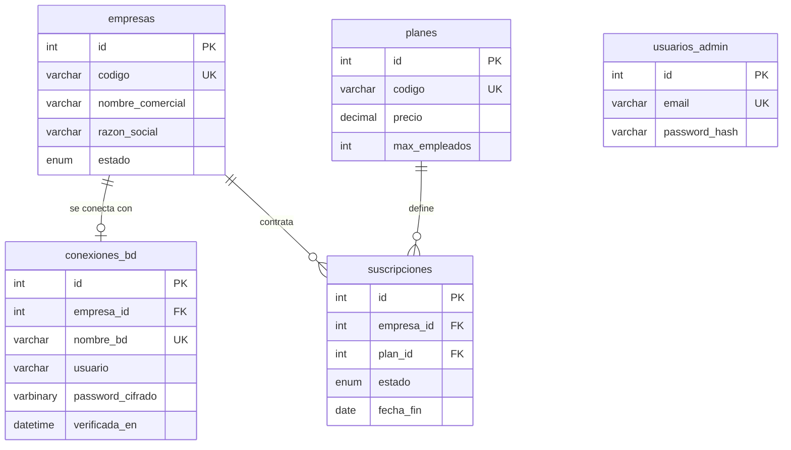

# Base `gscontrol_clientes` y panel de administración

> Plan de trabajo de gscontrolwebadmin. Crear la base de control `gscontrol_clientes` y un panel interno
> en Next.js, de uso exclusivo de INTECONAYC, para dar de alta y administrar empresas clientes,
> asignarles planes y suscripciones, y avisar cuando estén por vencer.

## Alcance

Proyecto nuevo desde cero. **No se toca ninguna base de datos existente del servidor**: no se leen,
no se modifican y no se migran datos desde ellas. Lo único que se crea es `gscontrol_clientes`,
y el trabajo llega hasta ahí.

Dentro del alcance de esta etapa:

- Crear la base `gscontrol_clientes`.
- Login exclusivo para INTECONAYC. No hay registro público ni acceso de clientes todavía.
- Alta, edición y baja de empresas clientes.
- Guardar los parámetros de conexión de la base que usará cada empresa, con la contraseña cifrada.
- Catálogo de planes y asignación de suscripciones a cada empresa.
- Alertas de suscripciones próximas a vencer y ya vencidas.
- Interfaz limpia y actual.

## Estado actual del entorno

Ya resuelto y funcionando:

- Conexión al MariaDB de DigitalOcean (`159.203.45.45`) a través de túnel SSH.
- `npm run check-db` verifica la conexión; `npm run tunnel` deja el túnel en `127.0.0.1:3307`.
- La llave SSH permanece en `~/.ssh/id_rsa_digitalocean`; el repo sólo guarda la ruta en `.env`, que está en `.gitignore`.
- El usuario `admin` de MariaDB tiene `ALL PRIVILEGES ON *.*`, así que puede crear la base nueva.

## Stack

Next.js (App Router) con TypeScript, Drizzle ORM sobre `mysql2`, Tailwind CSS con shadcn/ui, y Zod para validación. Drizzle en lugar de Prisma porque el modelo es una base por empresa y necesitamos abrir conexiones distintas en tiempo de ejecución.

Se reutiliza lo que ya funciona: el panel se conecta a `127.0.0.1:3307`, con el túnel de [scripts/tunnel.sh](../scripts/tunnel.sh) corriendo en otra terminal. Así Next.js no tiene que manejar SSH y no se reconecta en cada recarga en caliente.

## Diseño de la interfaz

Limpia y actual, sin adornos. Los lineamientos concretos:

- Layout con barra lateral fija y área de contenido amplia; nada de menús anidados profundos.
- Tailwind CSS con shadcn/ui, que da componentes accesibles y consistentes desde el inicio.
- Tipografía Inter, jerarquía clara por tamaño y peso, no por color.
- Paleta neutra con un solo color de acento; el color se reserva para los estados
  (activa, por vencer, vencida, suspendida) mostrados como etiquetas.
- Tema claro y oscuro desde el principio.
- Las tablas son el corazón del panel: con búsqueda, filtro por estado y orden por columna.
- Formularios en una sola columna, con validación en línea y mensajes claros en español.
- Estados vacíos con una acción sugerida, en lugar de tablas en blanco.

## Esquema de `gscontrol_clientes`

`empresas` guarda la ficha del cliente: `codigo` único tipo slug, nombre comercial, razón social, RFC, datos de contacto, `estado` (prospecto, prueba, activa, suspendida, cancelada), fecha de alta y notas.

`conexiones_bd` guarda cómo llegar a la base que usará esa empresa: `host`, `puerto`, `nombre_bd` (único, para que dos empresas no apunten a la misma), `usuario`, `password_cifrado`, más los campos de túnel SSH por si esa empresa vive en otro servidor. Incluye `verificada_en` con la fecha de la última prueba de conexión exitosa.

Punto importante: la contraseña de cada base se guarda **cifrada con AES-256-GCM**, nunca en claro. La llave vive en `APP_ENCRYPTION_KEY` dentro de `.env`.

`planes` define el catálogo comercial: `codigo`, nombre, descripción, precio, moneda, periodicidad sugerida y límites (empleados, dispositivos, usuarios).

`suscripciones` liga empresa y plan con `fecha_inicio`, `fecha_fin`, precio pactado, periodicidad, renovación automática y `estado` (prueba, activa, vencida, cancelada). El vencimiento sale de `fecha_fin`, que es lo que alimenta las alertas.

`usuarios_admin` son las cuentas de INTECONAYC, con `email` único y contraseña en bcrypt. Se crean a mano desde el seed; no hay alta pública.

## Alertas de vencimiento

Se calculan a partir de `suscripciones.fecha_fin`, sin tabla adicional. Una suscripción se clasifica
como por vencer cuando faltan 30, 15 o 7 días, y como vencida cuando la fecha ya pasó.

Se muestran en dos lugares: un resumen en el tablero de inicio con el conteo por categoría, y una
etiqueta de color en el listado de empresas. El envío por correo queda para después, anotado en
[features.md](features.md).

## Archivos principales

- `scripts/create-control-db.js` — `CREATE DATABASE IF NOT EXISTS gscontrol_clientes` a través del túnel, usando [src/db/connection.js](../src/db/connection.js) que ya existe
- `src/lib/db/schema.ts` — esquema Drizzle, única fuente de verdad de las tablas
- `drizzle.config.ts` — apunta a `127.0.0.1:3307/gscontrol_clientes`; las tablas se crean con `drizzle-kit`
- `src/lib/db/control.ts` — pool hacia la base de control
- `src/lib/db/tenant.ts` — abre conexión a la base de una empresa leyendo y descifrando sus parámetros
- `src/lib/crypto.ts` — cifrar y descifrar con AES-256-GCM
- `src/lib/suscripciones.ts` — cálculo del estado de vigencia y de los días restantes
- `src/app/(panel)/page.tsx` — tablero con el resumen de alertas
- `src/app/(panel)/empresas/page.tsx` — listado con estado, plan y vigencia
- `src/app/(panel)/empresas/nueva/page.tsx` y `[id]/page.tsx` — alta y edición, con ficha de la empresa, parámetros de conexión y suscripción
- `src/app/(panel)/planes/page.tsx` — catálogo de planes
- `src/app/(panel)/empresas/actions.ts` — server actions de guardar, asignar plan y **probar conexión**, que intenta conectarse a la base del cliente y actualiza `verificada_en`
- `src/auth.ts` y `middleware.ts` — login con Auth.js contra `usuarios_admin`, protegiendo todo el panel
- `scripts/seed.ts` — planes iniciales y el usuario administrador de INTECONAYC

El panel queda protegido con contraseña desde el inicio porque administra credenciales de bases de datos; dejarlo abierto sería riesgoso incluso en local.

## Variables nuevas en `.env`

`CONTROL_DB_NAME=gscontrol_clientes`, `APP_ENCRYPTION_KEY` (32 bytes en base64), `AUTH_SECRET`, y `DATABASE_URL` para que `drizzle-kit` pueda correr. Se reflejan sin valores en `.env.example`.

## Tareas

- [x] Crear `scripts/create-control-db.js` y ejecutarlo para crear la base `gscontrol_clientes` con utf8mb4.
- [x] Inicializar Next.js con TypeScript, Tailwind y shadcn/ui sobre el proyecto actual, conservando `scripts/tunnel.sh` y `src/db/connection.js`.
- [x] Definir `src/lib/db/schema.ts` en Drizzle con `empresas`, `conexiones_bd`, `planes`, `suscripciones` y `usuarios_admin`, configurar `drizzle.config.ts` y crear las tablas.
- [x] Implementar `src/lib/crypto.ts` con AES-256-GCM y `src/lib/db/tenant.ts` para abrir conexiones por empresa descifrando sus credenciales.
- [x] Implementar el login de INTECONAYC con Auth.js contra `usuarios_admin` y proteger el panel con middleware.
- [x] Construir el layout base del panel: barra lateral, tema claro y oscuro, y componentes de tabla y formulario.
- [x] Crear las pantallas de listado, alta y edición de empresas con sus parámetros de conexión y la acción de probar conexión.
- [x] Crear el catálogo de planes y la asignación de suscripciones a cada empresa.
- [x] Implementar el cálculo de vigencia y el tablero con las alertas de suscripciones por vencer y vencidas.
- [x] Sembrar planes y el usuario administrador, y verificar el flujo completo de punta a punta.

## Verificación

Levantar el túnel y el panel, entrar con el usuario sembrado de INTECONAYC, dar de alta una empresa,
capturar sus parámetros de conexión, asignarle un plan con una suscripción que venza en pocos días,
y confirmar que aparece en el tablero dentro de las alertas de vencimiento.

## Notas y pendientes

El servidor es MariaDB 10.3, de 2018 y ya sin soporte. No bloquea nada de esto, pero conviene planear una actualización más adelante.

Queda pendiente definir dónde se va a desplegar la aplicación; por ahora se trabaja en local contra el túnel.

Las funcionalidades que vayan surgiendo se registran en [features.md](features.md).
